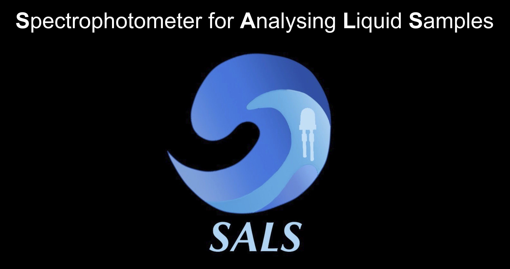
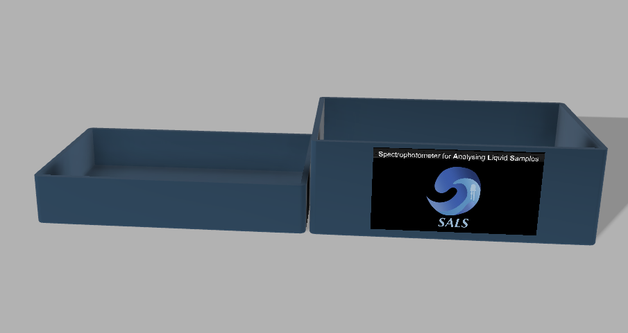
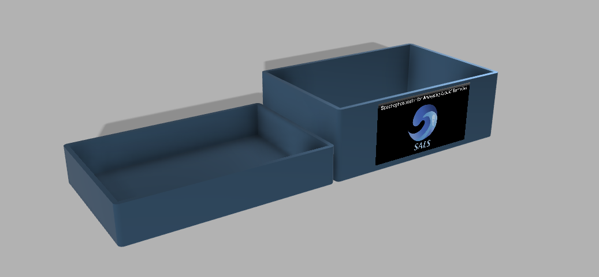
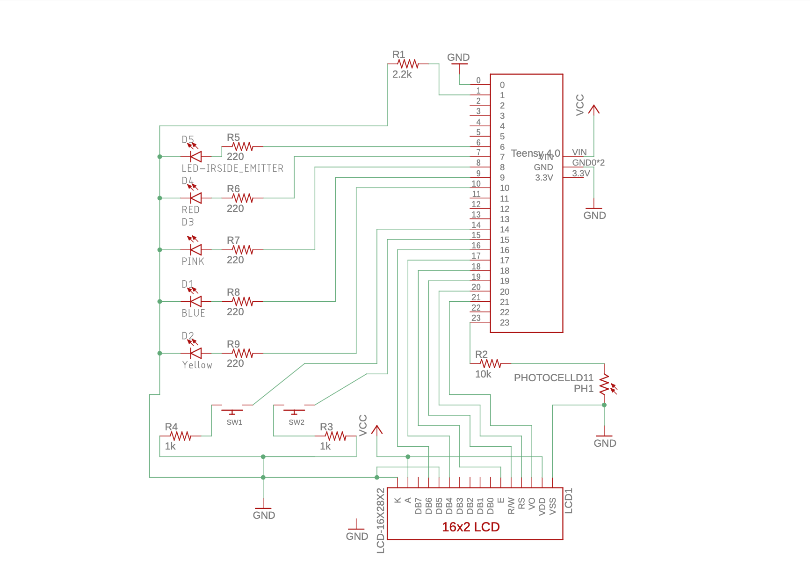
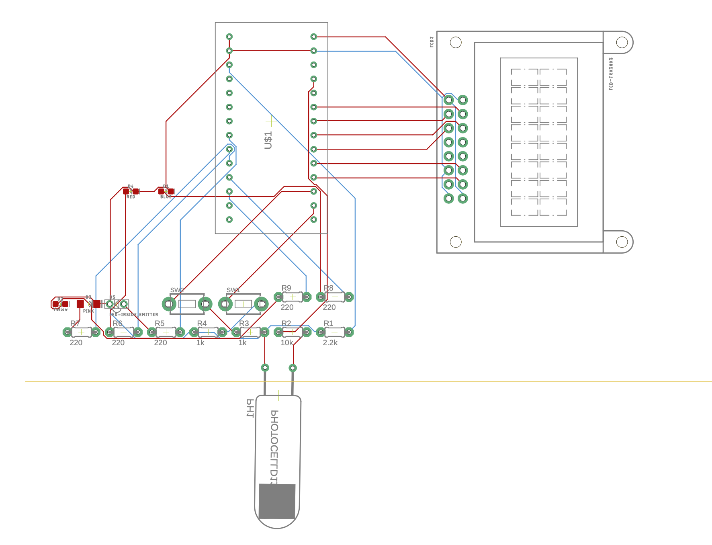
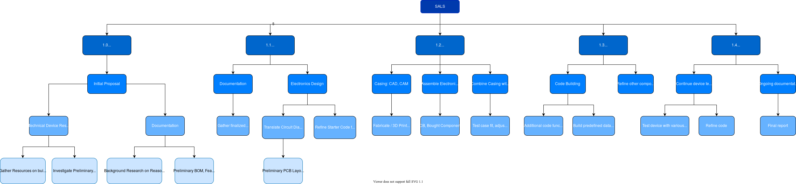

# Spectrophotometer for Analyzing Liquid Samples (SALS)
Spring 2020, Final Project for ISCI-496 Interactive Device Design (American University)

Lily Donaldson, Éowyn Fain, Cheldina Jean, Fiona Murphey

## Description
This is a device proposal for a spectrophotometer to analyze liquid samples. 

* This device shall analyze a liquid's chemical composition based on its spectral distribution by comparing its spectral data to a pre-defined or user-defined database of liquid spectral readings and returning a 'percent likeness' to these database spectra.
* This device shall allow for the creation of a user-defined database of liquid spectral readings
* This device may also be used to analyze a liquid's turbidity and/or potability.

This device is based off of archived designs from the "Safety Spectrometer" tutuorial formerly hosted by www.creative-technology.net

## File Descriptions
### Bill of Materials (BOM)
1. SALS_BOM.csv
	contents:

	|Part|Value             |Device                 |Package      |Description                               |
	|----|------------------|-----------------------|-------------|------------------------------------------|
	|D1  |BLUE              |LED-BLUE0603           |LED-0603     |Blue SMD LED                              |
	|D2  |Yellow            |LED-YELLOW0603         |LED-0603     |Yellow SMD LED                            |
	|D3  |PINK              |LED-PINK1206           |LED-1206     |Pink SMD LED                              |
	|D4  |RED               |LED-RED0603            |LED-0603     |Red SMD LED                               |
	|D5  |LED-IRSIDE_EMITTER|LED-IRSIDE_EMITTER     |LTE-302      |Infrared LED (IR)                         |
	|LCD1|LCD-16X28X2       |LCD-16X28X2            |LCD-8X2      |Standard text-only 16x2 parallel input LCD|
	|PH1 |PHOTOCELLD11      |PHOTOCELLD11           |D11XX_H      |Photo Sensor                              |
	|R1  |2.2k              |R-US_0204/5            |0204/5       |RESISTOR, American symbol                 |
	|R2  |10k               |R-US_0204/5            |0204/5       |RESISTOR, American symbol                 |
	|R3  |1k                |R-US_0204/5            |0204/5       |RESISTOR, American symbol                 |
	|R4  |1k                |R-US_0204/5            |0204/5       |RESISTOR, American symbol                 |
	|R5  |220               |R-US_0204/5            |0204/5       |RESISTOR, American symbol                 |
	|R6  |220               |R-US_0204/5            |0204/5       |RESISTOR, American symbol                 |
	|R7  |220               |R-US_0204/5            |0204/5       |RESISTOR, American symbol                 |
	|R8  |220               |R-US_0204/5            |0204/5       |RESISTOR, American symbol                 |
	|R9  |220               |R-US_0204/5            |0204/5       |RESISTOR, American symbol                 |
	|SW1 |                  |SWITCH_PUSHBUTTONEVQ-PE|TACT_PANA-EVQ|Buttons                                   |
	|SW2 |                  |SWITCH_PUSHBUTTONEVQ-PE|TACT_PANA-EVQ|Buttons                                   |
	|U$1 |TEENSY_4.0        |TEENSY_4.0             |TEENSY_4.0   |                                          |

### CAD Files for Case
1. SALS_Case.f3d

### Skeleton Code
1. spectrophotometer_skeleton_code.ino

> /* This code is an archive of http://www.creative-technology.net/MAKE/Spectrometer_Code.pdf 
> from April 15, 2010. The original file can be accessed on the WayBack Machine (https://web.archive.org/) */

### Circuit Board
#### Schematic
1. SALS.sch
2. SALS_schematic.pdf

#### PCB Design
3. SALS.sch
4. SALS_BRD.pdf

### Work Breakdown Structure (WBS)

### Class Presentations
1a. Prototype A.pdf

1b. Prototype A_SALS WBS Step 1.0_Device Proposal.pdf

2. Prototype B.pdf

## Further Development
Because of our university moving online due to the ongoing COVID-19 situation, we were not able fabricate this device. 
This documentation may be used to continue the project.

